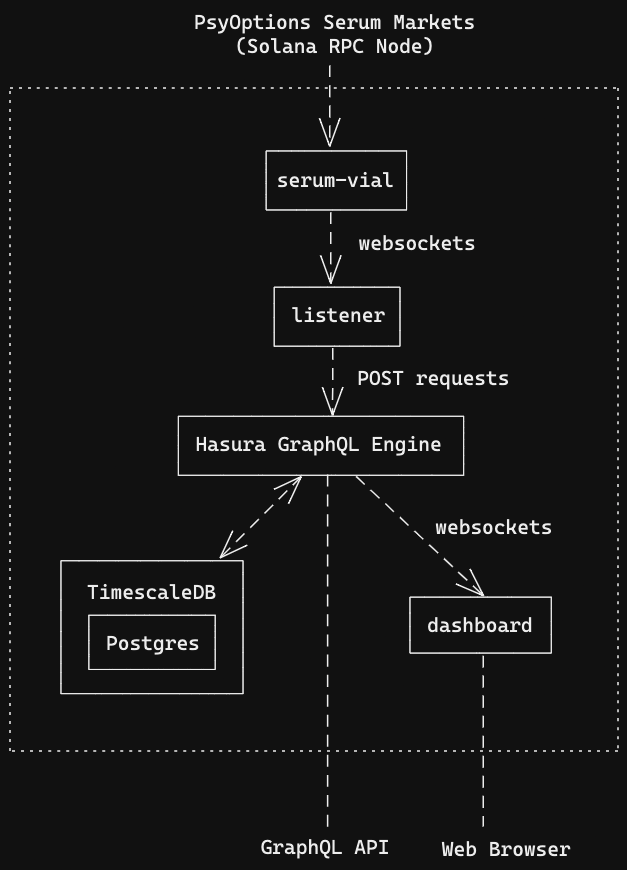

## How to run locally

1. install direnv (macOS: brew, ubuntu: apt) + [hook into shell](https://direnv.net/docs/hook.html)

2. run `direnv allow && docker-compose up --build`

3. open http://localhost, it will probably take a few mins of docker doing its thing before it works

4. do a buy or sell trade on devnet BTC-USDC May 2021 options

5. hopefully it'll show up in the table on http://localhost within a few seconds

## Architecture

## Deployment

Edit `.envrc` and run `docker-compose up --build -d`
